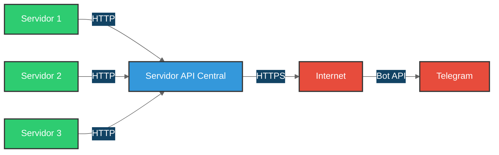

<div align="center">

# 🤖 API de Telegram Bot - Servidor Centralizado

[](https://hub.docker.com/r/ssanchezhlg/bot_telegram_oficial)
[](https://core.telegram.org/bots/api)
[](LICENSE)

*Una solución empresarial para la gestión centralizada de comunicaciones vía Telegram*

[Características](#características) •
[Instalación](#instalación) •
[Documentación](#documentación) •
[Contribuir](#contribuir)

</div>

---

## 📑 Tabla de Contenidos

<details open>
<summary>Expandir / Colapsar</summary>

1. [🎯 Descripción General](#descripción-general)
2. [⚙️ Especificaciones Técnicas](#especificaciones-técnicas)
3. [🐳 Despliegue con Docker](#despliegue-con-docker)
4. [📡 API de Mensajería](#api-de-mensajería)
5. [📜 Script EnvioTelegram.sh](#script-enviotelegramsh)
6. [💡 Ejemplo de Implementación](#ejemplo-de-implementación)

</details>

---

## 🎯 Descripción General

<div align="center">

### 🏗️ Arquitectura Centralizada



</div>

### ✨ Características Principales

<div class="grid-container">
<div class="grid-item">

#### 🔒 Control de Acceso
- Solo el servidor central necesita acceso a Internet
- Comunicación interna segura
- Superficie de exposición reducida
- Políticas de firewall simplificadas

</div>
<div class="grid-item">

#### 🔄 Gestión de Proxy
- Configuración centralizada
- Sin configuración en clientes
- Cambios simplificados
- Administración eficiente

</div>
</div>

<div class="grid-container">
<div class="grid-item">

#### 📊 Monitoreo y Auditoría
- Registro centralizado
- Logs detallados
- Seguimiento en tiempo real
- Análisis de rendimiento

</div>
<div class="grid-item">

#### ⚡ Optimización
- Rate limits gestionados
- Cola centralizada
- Reintentos automáticos
- Uso eficiente de recursos

</div>
</div>

---

## ⚙️ Especificaciones Técnicas

### 🛠️ Configuración Base

<details>
<summary><b>Parámetros Principales</b></summary>

| Parámetro | Valor | Descripción |
|:---------:|:-----:|:------------|
| Puerto | `8443` | Configurable vía `PORT` |
| Host | `0.0.0.0` | Acceso desde cualquier IP |
| Versión API | `v1` | Versión actual |
| Formato | `JSON` | Formato de datos |

</details>

### 🔐 Variables de Entorno

<details open>
<summary><b>Configuración Requerida</b></summary>

```bash
# Credenciales del Bot
BOT_TOKEN="{token_del_bot_telegram}"       # Token de BotFather
CHAT_ID="{id_del_chat}"                    # ID del grupo/canal

# Seguridad y Configuración
EXPECTED_TOKEN="{token_autenticacion}"     # Token de seguridad
PORT="8443"                                # Puerto de escucha
proxy_address="None"                       # Configuración de proxy
```

</details>

---

## 🐳 Despliegue con Docker

### 📦 Instalación Rápida

```bash
docker run -d \
  --name bot_telegram \
  --restart always \
  -p 8443:8443 \
  -e PORT=8443 \
  -e BOT_TOKEN=your_token \
  -e CHAT_ID=your_chat_id \
  -e EXPECTED_TOKEN=your_auth_token \
  -v /path/to/logs:/srv/log \
  ssanchezhlg/bot_telegram_oficial:1.3
```

### 📦 Instalación con Docker Compose

Crea un archivo `docker-compose.yml`:

```yaml
version: '3.8'

services:
  bot_telegram:
    image: ssanchezhlg/bot_telegram_oficial:1.3
    restart: always
    container_name: bot_telegram
    ports: 
      - '8443:8443'
    environment:
      - PORT=8443
      - BOT_TOKEN=1234567890:ABCdefGHIjklMNOpqrsTUVwxyz123456789
      - CHAT_ID=-100987654321
      - EXPECTED_TOKEN=abc123def456ghi789jkl012mno345pqr678
      - proxy_address=                                    
    volumes:
      - './logs:/srv/log'
```

Inicia el servicio con:
```bash
docker-compose up -d
```

### 📋 Instalación con Portainer Stack

Crea un nuevo stack en Portainer y usa esta configuración:

```yaml
version: "3"

services:
  bot_telegram:
    image: ssanchezhlg/bot_telegram_oficial:1.3
    restart: always
    container_name: bot_telegram
    ports: 
      - '8443:8443'
    environment:
      - SERVER_PORT=8443
      - BOT_TOKEN=1234567890:ABCdefGHIjklMNOpqrsTUVwxyz123456789
      - CHAT_ID=-100987654321
      - EXPECTED_TOKEN=abc123def456ghi789jkl012mno345pqr678
      - proxy_address=192.168.1.100:3128                    # Usar 'none' si no se requiere proxy
      - LOG_DIR=/var/log/telegram-bot
    volumes:
      - 'bot-telegram_volumen:/var/log/telegram-bot' 
      
    deploy:
      mode: replicated
      replicas: 1
      placement:
        constraints: []  	
        
volumes:
  bot-telegram_volumen:
    driver: local
    driver_opts:
      type: "nfs4"
      o: addr=192.168.1.250,nolock,soft,rw
      device: ":/storage/docker/telegram-bot"  
```

### 📋 Parámetros Docker

| Parámetro | Descripción |
|:---------:|:------------|
| `-d` | Ejecución en segundo plano |
| `--name` | Nombre del contenedor |
| `--restart` | Política de reinicio |
| `-p` | Mapeo de puertos |
| `-e` | Variables de entorno |
| `-v` | Volumen para logs |

> 💡 **Tip**: Verifica la instalación accediendo a `http://IP:8443`

## 📡 API de Mensajería

### 📤 Endpoints Disponibles

<details open>
<summary><b>Envío de Mensaje Simple</b></summary>

```bash
curl -X POST http://127.0.0.1:8443 \
    -H "Content-Type: application/json" \
    -d '{
        "token": "your_auth_token",
        "message": {
            "text": "Mensaje de prueba",
            "topic_id": "2"
        }
    }'
```
</details>

<details>
<summary><b>Mensaje con Formato HTML</b></summary>

```bash
curl -X POST http://127.0.0.1:8443 \
    -H "Content-Type: application/json" \
    -d '{
        "token": "your_auth_token",
        "message": {
            "text": "<b>Mensaje</b> con <i>formato</i>",
            "topic_id": "2"
        }
    }'
```
</details>

<details>
<summary><b>Envío con Archivo Adjunto</b></summary>

```bash
curl -X POST http://127.0.0.1:8443 \
    -H "Content-Type: application/json" \
    -d '{
        "token": "your_auth_token",
        "message": {
            "text": "Archivo adjunto",
            "topic_id": "2",
            "file_path": "/ruta/al/archivo"
        }
    }'
```
</details>

### 📊 Códigos de Respuesta

| Código | Estado | Descripción |
|:------:|:------:|:------------|
| 200 | ✅ Éxito | Operación completada |
| 400 | ❌ Error | JSON inválido |
| 403 | 🚫 Prohibido | Token inválido |
| 404 | 🔍 No encontrado | Archivo no existe |
| 500 | ⚠️ Error | Error del servidor |

---

## 📜 Script EnvioTelegram.sh

### 🔧 Características Avanzadas

<div class="grid-container">
<div class="grid-item">

#### 🔄 Alta Disponibilidad
- Múltiples servidores de respaldo
- Verificación de estado
- Failover automático
- Comprobación de salud

</div>
<div class="grid-item">

#### 📨 Sistema de Mensajería
- Soporte HTML y texto plano
- División automática de mensajes
- Gestión de adjuntos
- Soporte para topics

</div>
</div>

<div class="grid-container">
<div class="grid-item">

#### 📝 Sistema de Logs
- Múltiples niveles de log
- Rotación automática
- Compresión de históricos
- Limpieza programada

</div>
<div class="grid-item">

#### 📊 Monitoreo
- Registro de eventos
- Seguimiento de entregas
- Análisis de errores
- Métricas de rendimiento

</div>
</div>

### ⚙️ Configuración

<details open>
<summary><b>Variables Principales</b></summary>

```bash
# Configuración de Servidores
BotServers=("IP del API")
UrlBot="http://%s:8443"
BotToken="your_auth_token"

# Configuración de Logs
log_dir="/var/log/Telegran"
USE_HTML="true"
MAX_LOG_DAYS=30
```
</details>

### 📦 Requisitos de Sistema

```bash
# Instalación de Dependencias
sudo apt-get update
sudo apt-get install -y jq curl

# Configuración de Permisos
chmod +x EnvioTelegram.sh
chmod 755 /home/python/servercentralizado/logs
```

---

## 💡 Ejemplo de Implementación

### 📝 Script de Notificación

<details open>
<summary><b>Iniciando_Servidor.sh</b></summary>

```bash
#!/bin/bash

# Configuración
date="$(date +"%A, %e de %B de %Y, %r" | sed 's/./\L&/g')"
hostname="$(hostname -f)"
TOPIC_ID="3"
destinatarios="usuario1@dominio.com,usuario2@dominio.com"

# Mensaje
message="💻 Servidor [ $hostname ] Iniciado
✅ Estado: Operativo
🕒 Fecha: $date

¡Sistema listo para operar!

Saludos,
🤖 Asistente Virtual"

# Envío de Notificaciones
/home/python/servercentralizado/scripts/EnvioTelegram.sh "$message" "$TOPIC_ID"
echo -e "$message" | mailx -s "✨ Servidor Iniciado: $hostname" $destinatarios
```
</details>

> 🔧 **Nota**: No olvides dar permisos de ejecución: `chmod +x Iniciando_Servidor.sh`

---

<div align="center">

## 🤝 Contribuir

¿Encontraste un bug? ¿Tienes una idea? ¡Nos encantaría escucharte!

[](https://github.com/username/repo/issues)
[](https://github.com/username/repo/pulls)

## 📄 Licencia

Este proyecto está bajo la Licencia MIT - ver el archivo [LICENSE](LICENSE) para más detalles.

---

<sub>Desarrollado con ❤️ por el equipo de desarrollo</sub>

</div>